# Laboratorio de Seguridad de Redes con FortiGate

**Estudiante:** Edwin De Paula  
**Matrícula:** 2024-2415  
**Institución:** Instituto Tecnológico de las Américas (ITLA)  
**Asignatura:** Seguridad de Redes

---

## Video

| Recurso | URL |
|---|---|
| Video YouTube | _pendiente_ |

---

## Objetivo

Diseñar y configurar, en su totalidad por interfaz gráfica (GUI), una topología de red segura utilizando FortiGate como firewall perimetral e interno. La red segmenta el tráfico entre una LAN de usuarios y una LAN de servidores, permite salida controlada a Internet mediante NAT, y aplica múltiples capas de seguridad: control de acceso por servicio, filtrado de aplicaciones, filtrado web, detección de escaneo de red y protección de aplicaciones web (WAF).

El direccionamiento IP de toda la topología se derivó de la matrícula del estudiante (2024-2415), utilizando la red base `10.24.15.0/24`.

---

## Topología

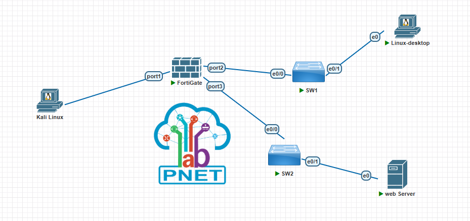

| Dispositivo | Interfaz | Dirección IP | Descripción |
|---|---|---|---|
| Kali Linux | eth0 | DHCP (vmnet8) | Acceso a GUI del FortiGate / equipo de pruebas de escaneo |
| FortiGate | port1 | DHCP | WAN |
| FortiGate | port2 | 10.24.15.1/25 | LAN Usuarios |
| FortiGate | port3 | 10.24.15.129/28 | LAN Servidores |
| Linux-Desktop | eth0 | DHCP (10.24.15.10-100) | Cliente de pruebas, LAN Usuarios |
| web Server (Metasploitable2 + DVWA) | eth0 | 10.24.15.130/28 | Servidor web, LAN Servidores |

---

## Parámetros de Configuración

### Interfaces

| Parámetro | Valor |
|---|---|
| port2 - Alias | LAN_Usuarios |
| port2 - IP/Netmask | 10.24.15.1 / 255.255.255.128 |
| port2 - Role | LAN |
| port3 - Alias | LAN_Servidores |
| port3 - IP/Netmask | 10.24.15.129 / 255.255.255.240 |
| port3 - Role | LAN |

### DHCP Server (port2)

| Parámetro | Valor |
|---|---|
| Rango | 10.24.15.10 - 10.24.15.100 |
| Netmask | 255.255.255.128 |
| Default Gateway | 10.24.15.1 |
| DNS Server | Same as System DNS |

### Ruta por Defecto

| Parámetro | Valor |
|---|---|
| Destination | 0.0.0.0/0 |
| Interface | port1 |
| Gateway | Aprendido automáticamente por DHCP |

### Política NAT - Usuarios a Internet

| Parámetro | Valor |
|---|---|
| Nombre | Usuarios_a_Internet |
| Incoming / Outgoing | port2 / port1 |
| Service | ALL |
| NAT | Enable - Use Outgoing Interface Address |

### Políticas LAN Usuarios → LAN Servidores

| Parámetro | Usuarios_a_Servidores_HTTP_Allow | Usuarios_a_Servidores_DENY_ALL |
|---|---|---|
| Incoming / Outgoing | port2 / port3 | port2 / port3 |
| Service | HTTP | ALL |
| Action | ACCEPT | DENY |
| Inspection Mode | Proxy-based | Flow-based |
| Orden | 1 (arriba) | 2 (abajo) |

### Application Control - Bloqueo_RedesSociales_WhatsApp

| Parámetro | Valor |
|---|---|
| Categoría | Social.Media → Block |
| Application Override | WhatsApp_VoIP.Call → Block |
| Aplicado a | Usuarios_a_Internet |

### Web Filter - Bloqueo_ITLA

| Parámetro | Valor |
|---|---|
| URL 1 | itla.edu.do (Wildcard) → Block |
| URL 2 | *.itla.edu.do (Wildcard) → Block |
| Aplicado a | Usuarios_a_Internet |

### DoS Policy - AntiScan_Servidores

| Parámetro | Valor |
|---|---|
| Incoming Interface | port2 |
| Anomalías | tcp_port_scan, icmp_sweep → Block |
| Threshold | Ajustado por debajo del valor por defecto |

### WAF - WAF_WebServer

| Parámetro | Valor |
|---|---|
| Categorías | SQL Injection, Cross Site Scripting (XSS) |
| Sensibilidad | High |
| Aplicado a | Usuarios_a_Servidores_HTTP_Allow |

---

## Explicación de la Configuración

### Segmentación y NAT

El FortiGate separa el tráfico en tres interfaces: `port1` como WAN, `port2` como LAN de Usuarios (/25, con DHCP) y `port3` como LAN de Servidores (/28, con IP estática). La política `Usuarios_a_Internet` habilita NAT de origen (`Use Outgoing Interface Address`), traduciendo las IPs privadas de la LAN de Usuarios a la IP pública asignada en `port1` para poder salir a Internet.

### Control de tráfico HTTP-only

Entre LAN Usuarios y LAN Servidores se crearon dos políticas evaluadas en orden: primero `Usuarios_a_Servidores_HTTP_Allow` (permite únicamente el servicio HTTP) y después `Usuarios_a_Servidores_DENY_ALL` (bloquea explícitamente cualquier otro servicio). FortiGate evalúa las políticas de arriba hacia abajo y aplica la primera coincidencia, por lo que el orden es crítico: si `DENY_ALL` quedara primero, bloquearía también el HTTP permitido.

### Application Control

Se bloqueó la categoría `Social.Media` completa para cubrir el acceso a redes sociales, y de forma independiente se bloqueó la firma granular `WhatsApp_VoIP.Call` dentro de Application Overrides. Se optó por la firma específica de llamadas en lugar de bloquear la aplicación WhatsApp completa, para cumplir exactamente el requisito de bloquear llamadas sin afectar la mensajería de texto.

### Web Filter

El Static URL Filter usa entradas tipo `Wildcard` para `itla.edu.do` y `*.itla.edu.do`, cubriendo tanto el dominio raíz como cualquier subdominio.

### Detección de escaneo (DoS Policy)

En lugar de depender de firmas IPS descargadas de FortiGuard (no siempre disponibles en un entorno de laboratorio aislado), se utilizó una DoS Policy que detecta el patrón de escaneo por anomalía de tráfico (volumen de puertos/hosts tocados en poco tiempo). La acción `clear_session` corta la sesión activa en cuanto se identifica el patrón.

### WAF

WAF es una función exclusiva del modo de inspección Proxy-based, que en FortiOS 6.4.x se configura de forma individual por política (no de forma global). Se activó Proxy-based únicamente en `Usuarios_a_Servidores_HTTP_Allow` y se aplicó el perfil con las categorías de SQL Injection y XSS en nivel de sensibilidad "High".

---

## Verificación

### Interfaces y DHCP

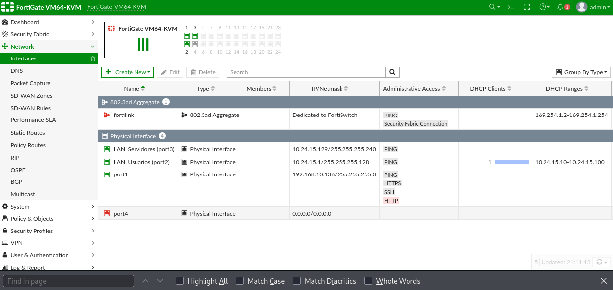

Confirma `port2` con `10.24.15.1/255.255.255.128` y rango DHCP `10.24.15.10-10.24.15.100`, y `port3` con `10.24.15.129/255.255.255.240`.

### Ruta por defecto

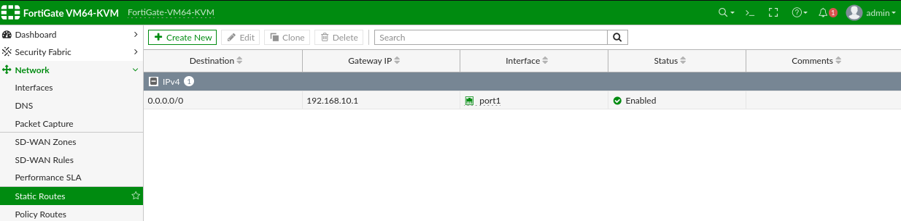

La ruta `0.0.0.0/0` aparece habilitada con gateway aprendido automáticamente vía `port1`.

### NAT y acceso a Internet

```
ping 8.8.8.8
```

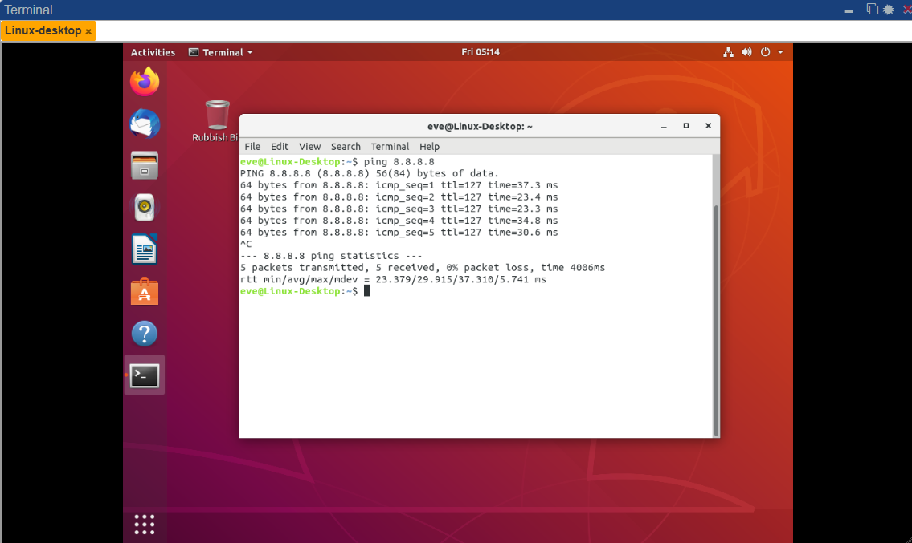

Respuesta exitosa desde Linux-Desktop, confirma NAT funcionando en la política `Usuarios_a_Internet`.

### Política HTTP-only

```
curl http://10.24.15.130
ping 10.24.15.130
```

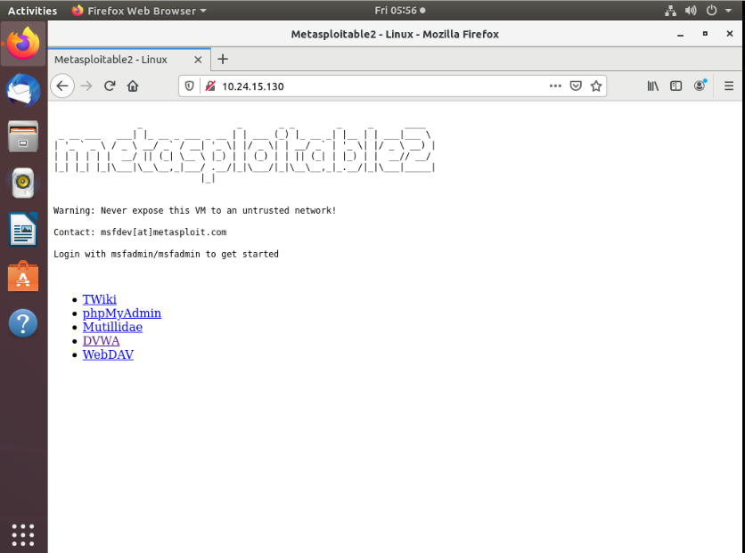
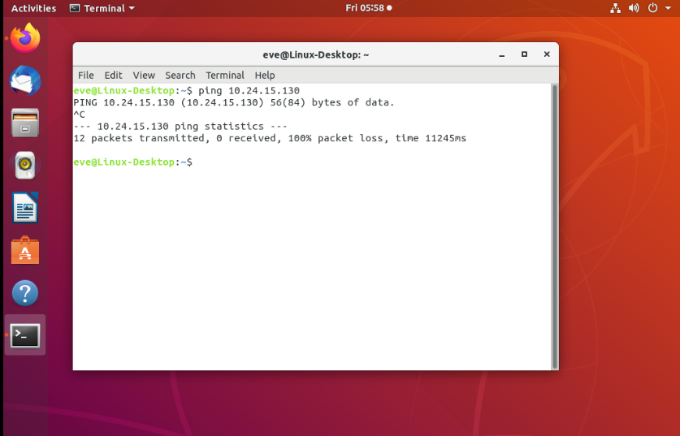

El HTTP carga correctamente; el ping y cualquier otro servicio hacia el servidor son descartados por `Usuarios_a_Servidores_DENY_ALL`.

### Bloqueo de redes sociales

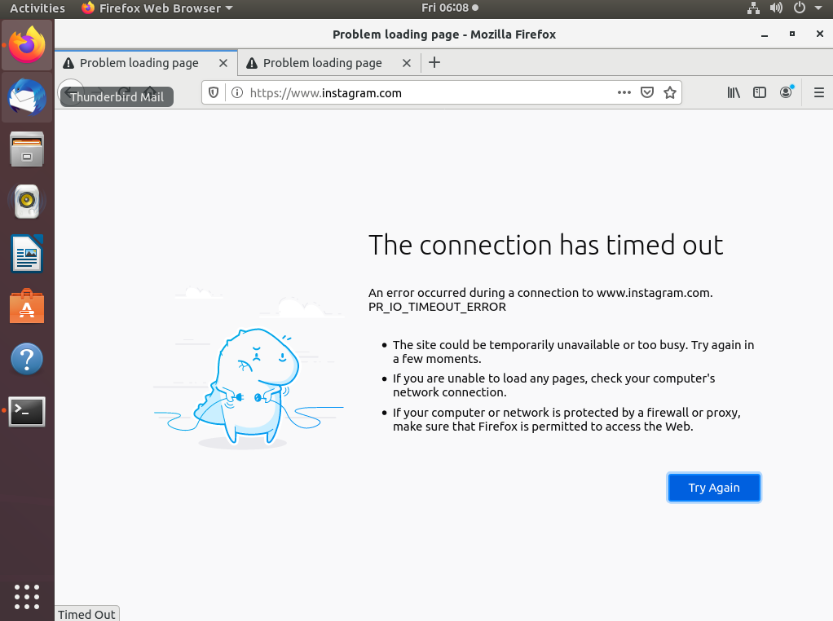

Intento de acceso a Facebook/Instagram interceptado por la página de bloqueo de FortiGuard.

### Bloqueo de itla.edu.do

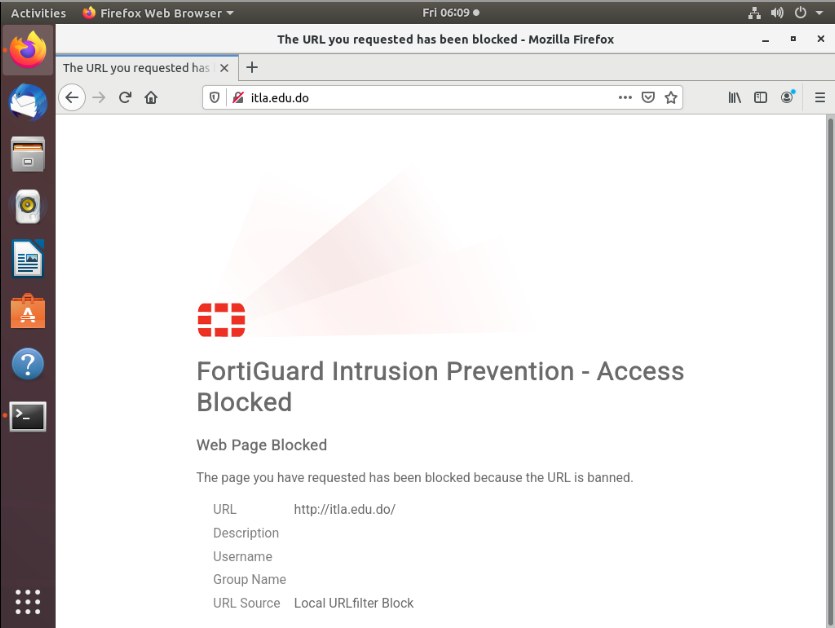

### Detección de escaneo de red

```
nmap -sS -Pn 10.24.15.130
```

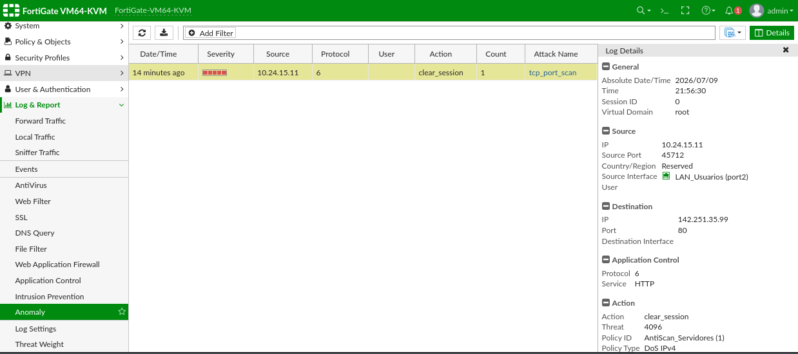

| Fecha/Hora | Severidad | Origen | Protocolo | Acción | Ataque |
|---|---|---|---|---|---|
| — | Alta | 10.24.15.10 | TCP (6) | clear_session | tcp_port_scan |

### WAF - SQL Injection y XSS (DVWA)

```
1' OR '1'='1
<script>alert('test')</script>
```

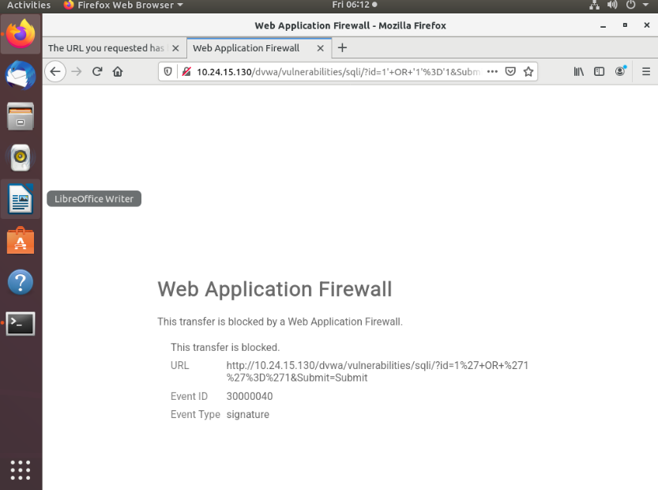
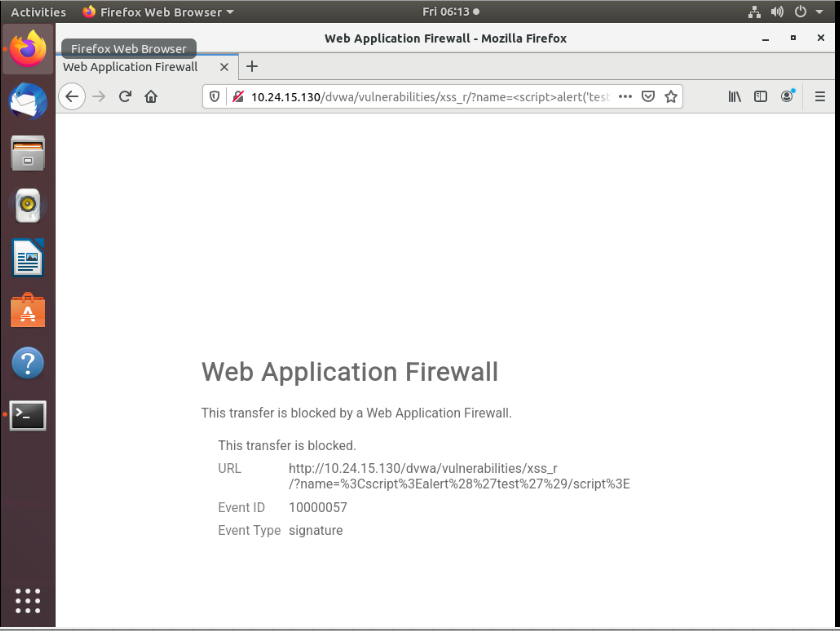
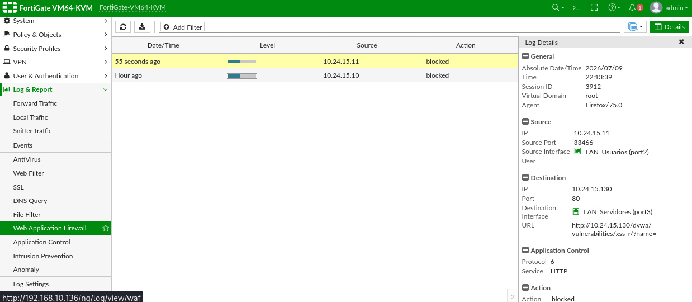

Ambos payloads son bloqueados por el perfil `WAF_WebServer` al ejecutarlos contra DVWA en nivel de seguridad "High".

---

## Limitaciones Conocidas del Entorno

- **Acceso administrativo HTTPS a la GUI:** se identificó un bug de corrupción de paquetes TLS en el vNIC `e1000` emulado por VMware/PNetLab (`SSL_ERROR_RX_RECORD_TOO_LONG`). Se utilizó HTTP para la administración durante el laboratorio.
- **Prueba en vivo de llamada de WhatsApp:** la imagen de Windows 10 disponible presentó un error de arranque (`0xc000000f`) por incompatibilidad de modo de arranque con la emulación del template QEMU de PNetLab. El bloqueo de llamadas de WhatsApp queda demostrado mediante la firma `WhatsApp_VoIP.Call` en modo Block (ver Application Control), sin ejecutar una llamada real.

---

## Archivos del Repositorio

```
FortiGate-Network-Security-Lab-2024-2415/
├── docs/
│   ├── documentacion-tecnica.pdf
│   └── screenshots/
│       ├── topology.png
│       ├── interfaces-resumen.png
│       ├── static-route.png
│       ├── ping-internet.png
│       ├── http-allowed.png
│       ├── resto-bloqueado.png
│       ├── test-socialmedia.png
│       ├── test-itla.png
│       ├── dos-log.png
│       ├── waf-sqli-block.png
│       ├── waf-xss-block.png
│       └── waf-log.png
└── README.md
```

---

## Herramientas Utilizadas

- PNetLab — Plataforma de emulación de red
- FortiGate-VM64-KVM (FortiOS 6.4.6) — Firewall emulado
- Kali Linux — Acceso a GUI y pruebas de escaneo (nmap)
- Metasploitable2 + DVWA — Servidor web vulnerable para pruebas de WAF
- VMware Workstation — Virtualización del servidor PNetLab
